# GitFlow Helper

  
  
  

> **WHAT'S NEW IN v2.8.0**  
> • **Proactive Divergence Indicator in Status Bar**: Real-time badge showing commits behind `develop` (`⬇ N`) with instant 1-click branch synchronization!  
> • **Customizable Log Typography**: Select custom font family and font size directly in the Logs tool window.  
> • **Repository Context in Logs & Flow**: Interactive repo selection in the Flow diagram panel and clear repo name prefix in execution logs.  
> • **Optional Task Selection on Feature Start**: Create feature branches with or without binding to an issue tracker task.  
> • **Safe Background Execution**: GitFlow menu is automatically disabled during background operations to prevent branch conflicts.  
> • **New Interactive About Dialog**: Comprehensive built-in documentation guide (`UsageDialog`).

> **OTHER IMPORTANT FEARTURES**  
> • **Extended Issue Tracker Integrations**: Full support for **Jira**, **GitHub**, **GitLab**, and **Redmine**!  
> • **Dedicated 4-Tab Tool Window**: Dedicated views for **Logs**, **Issues** (rich task detail & actions), **Flow** (visual GitFlow branch graph), and **CI/CD** (Jenkins pipeline tracking)!  
> • **Jenkins CI/CD Pipeline Monitoring**: Real-time build status tracking and progressive console log streaming.  
> • **Comprehensive Safety Guardrails**: Pre-finish checks for uncommitted changes, unpushed commits, and divergence blocking, plus protected branch commit warnings for `main` and `develop`.  
> • **Multi-Repository Workspace Support**: Independent configuration and execution across multi-repo projects.

---

## 📖 Overview

**GitFlow Helper** brings the complete [Vincent Driessen Git Flow branching strategy](https://nvie.com/posts/a-successful-git-branching-model/) natively into JetBrains IDEs.

It executes all Git operations programmatically via asynchronous IntelliJ Platform APIs without requiring external Git Flow CLI tools. In addition to branch automation, it deeply integrates with your **Issue Trackers** (Jira, GitHub, GitLab, Redmine), **CI/CD pipelines** (Jenkins), and provides interactive visual flow diagrams right inside your IDE.

---

## ✨ Key Features

### 🌱 Git Flow Initialization & Configuration
- Initialize Git Flow directly from your IDE with a single click.
- Fully customizable parameters:
  - `main` production branch name
  - `develop` integration branch name
  - Branch prefixes for `feature/`, `release/`, and `hotfix/`
  - Version tag prefix (e.g. `v`)
- Multi-repository workspace support: easily enable, disable, and configure Git Flow per repository.
- Safe configuration reset action to reconfigure branch conventions whenever needed.

  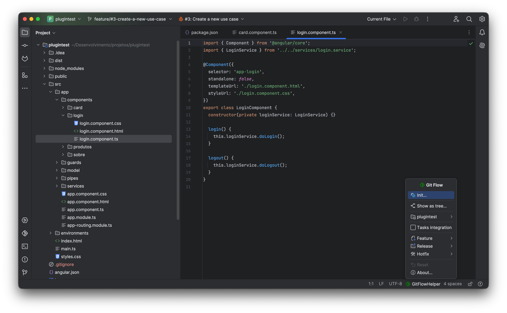
  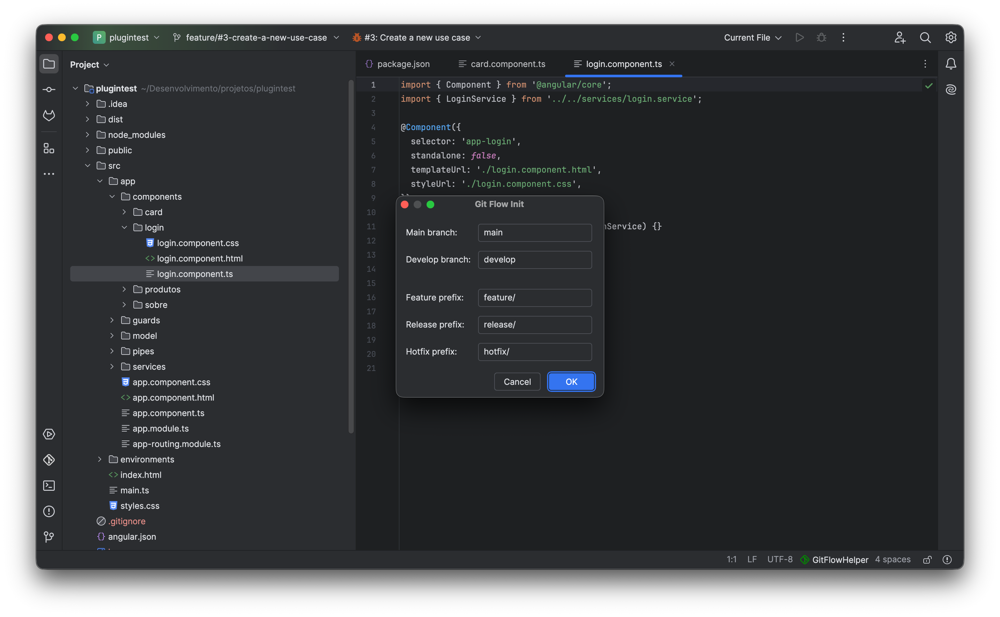

---

### 🌳 Git Flow Branching Model
The plugin follows the standard Git Flow strategy with zero CLI overhead:

- **Main Branch (`main` / `master`)**: Represents production-ready, release-tested code.
- **Develop Branch (`develop`)**: Central integration branch for ongoing development.
- **Feature Branches (`feature/*`)**: Created from `develop`. Finished features merge back into `develop`.
- **Release Branches (`release/*`)**: Forked from `develop` for stabilization, version bumping, and release preparation. Merged back into both `main` and `develop` with automated version tags.
- **Hotfix Branches (`hotfix/*`)**: Created directly from `main` for critical production fixes. Merged back into both `main` and `develop` with patch tags.

  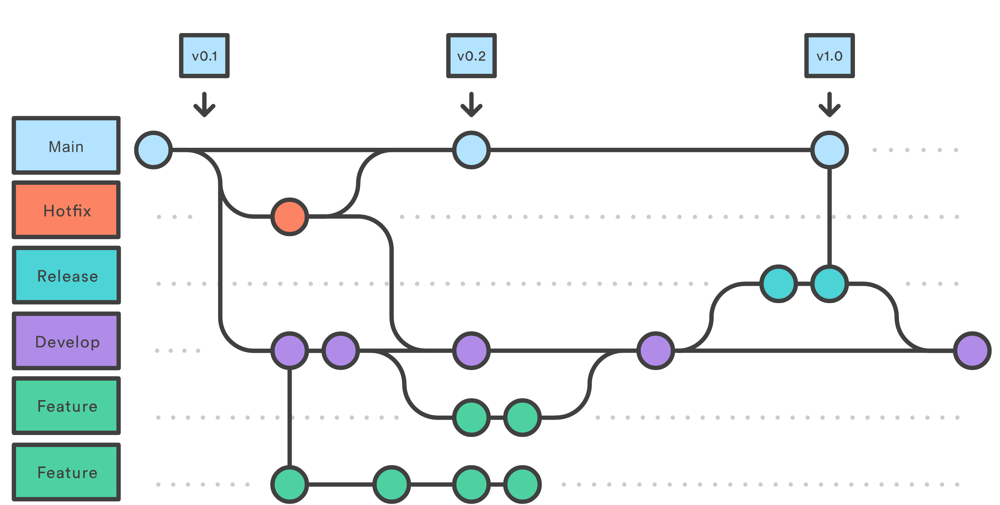

---

### ⚡ Proactive Divergence Indicator & 1-Click Sync
Never let your working branch become stale or drift far behind development:
- **Real-Time Status Bar Badge (`⬇ N`)**: Displays an interactive divergence badge whenever your active `feature`, `release`, or `hotfix` branch falls behind its base branch (`develop` or `main`).
- **1-Click Synchronization**: Click the status bar badge or select **Feature Sync**, **Release Sync**, or **Hotfix Sync** to automatically fetch remote changes and cleanly rebase/merge the base branch into your working branch.
- **Continuous Background Awareness**: Triggers automatically on repository updates, IDE focus activation, and background scheduled checks.

---

### 🛡️ Safety Guardrails & Pre-Finish Checks
GitFlow Helper prevents broken states, untracked work loss, and accidental direct commits:

1. **Protected Branch Commit Guard (`CheckinHandler`)**:
   - Intercepts commit attempts made directly to protected branches (`main` or `develop`).
   - Displays a warning dialog urging developers to work within dedicated feature or hotfix branches.
2. **Uncommitted Changes Verification**:
   - Scans for dirty working tree files before finishing a branch. Prompts to commit changes or abort.
3. **Unpushed Commits Check**:
   - Verifies whether local commits have been pushed upstream before finishing to avoid history divergence.
4. **Divergence Blocker (`isBehind`)**:
   - Blocks branch finishing if the branch is behind `develop`. Developers are instructed to synchronize first to resolve any potential merge conflicts in their own branch.

---

### 🔀 Flexible Finish & Approval Workflows
When finishing a feature, choose the workflow that best matches your team's code review process:

- **Integrate Immediately**: Checks out `develop`, pulls latest changes, performs a merge (standard `--no-ff` or squashed into a single clean commit), pushes to remote, and optionally deletes local and remote branches.
- **Create Merge Request (GitLab)**: Uses native Git push options (`-o merge_request.create`, `-o merge_request.target`, etc.) to create an open MR automatically.
- **Self-Create (GitHub / Bitbucket / Azure DevOps)**: Pushes your feature branch to remote origin and keeps it alive for manual pull request opening and code review.
- **Automatic Task Closing**: Automatically transitions and closes the linked issue tracker task upon successful completion.

  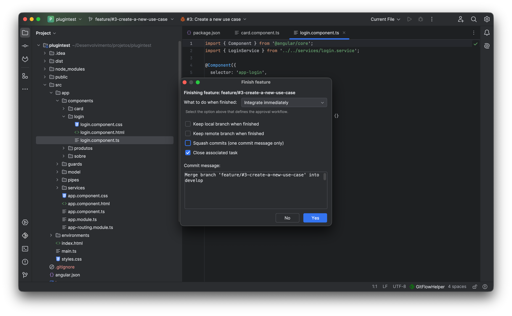

---

### 🪟 Dedicated 4-Tab Tool Window
Monitor every aspect of your Git workflow in a dedicated bottom Tool Window:

1. **Logs Tab**:
   - Real-time display of all Git commands executed by the plugin (stdout, stderr, exit codes).
   - Live activity indicator on the tool window icon when commands are running.
   - Customizable log font family and font size.
   - Multi-repository tagging: clear repository prefixes in logs when working with multi-root projects.
   - One-click log clearing.
2. **Issues Tab**:
   - Side-by-side list and detail inspector for tasks assigned to you.
   - Rich task summary, description, and comments.
   - Direct buttons to start **Feature** or **Hotfix** branches directly from any task.
3. **Flow Tab**:
   - Interactive visual graph of your local Git branches.
   - Color-coded branches: Main (Blue), Develop (Green), Features (Orange), Releases (Cyan), Hotfixes (Red).
   - Shows origin connection lines, active checkout markers, and per-repository selector.
4. **CI/CD Tab**:
   - Dedicated Continuous Integration monitoring.
   - Live streaming of build console logs with color highlights.
   - Build status tracking and stop/clear controls.

  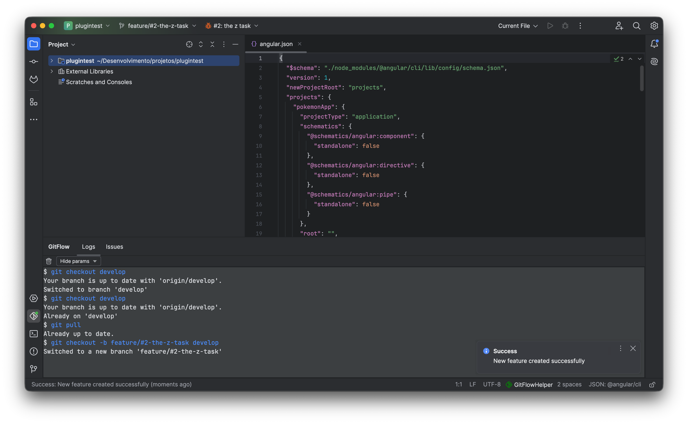

---

### 🔗 Issue Trackers & Task Management
Seamlessly connects to IntelliJ IDEA's **Task Management** subsystem (`com.intellij.tasks`):

- **Supported Platforms**:
  - **GitHub Issues**
  - **GitLab Issues & Merge Requests**
  - **Jira Software**
  - **Redmine**
- **Automated Workflow**:
  - Automatically sanitizes issue keys and titles into clean branch names (e.g. `feature/PROJ-1234-add-oauth-login`).
  - Automatically assigns the issue to you and sets status to **In Progress** when starting work.
  - Quick action to open the active task directly in your default browser.
  - Automatically closes the task on the server when finishing the branch.

  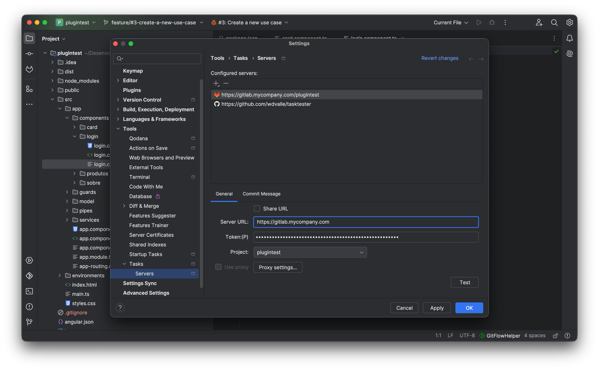
  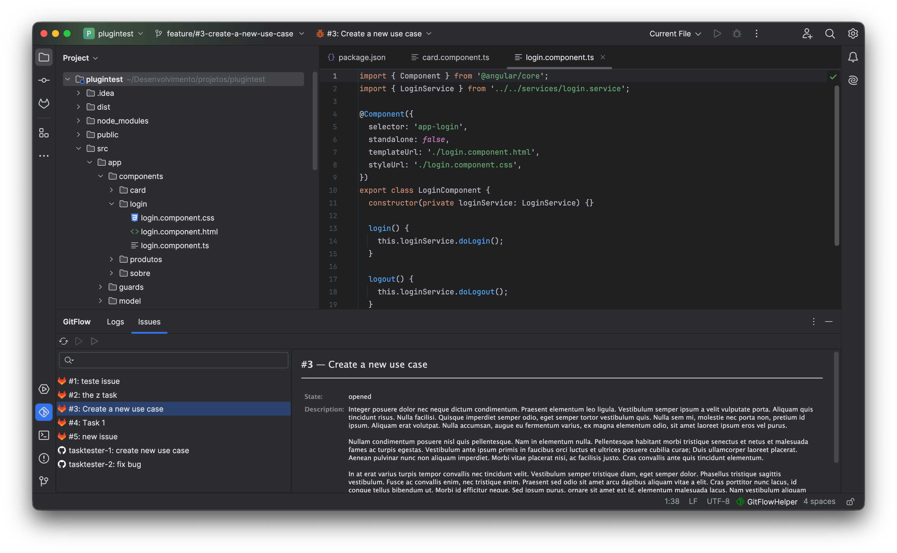

  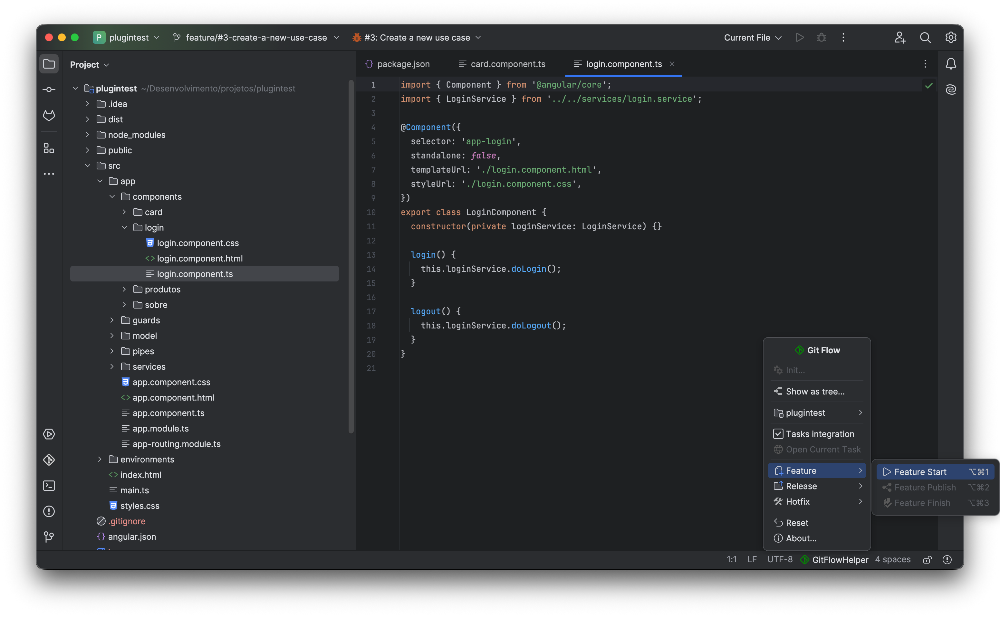
  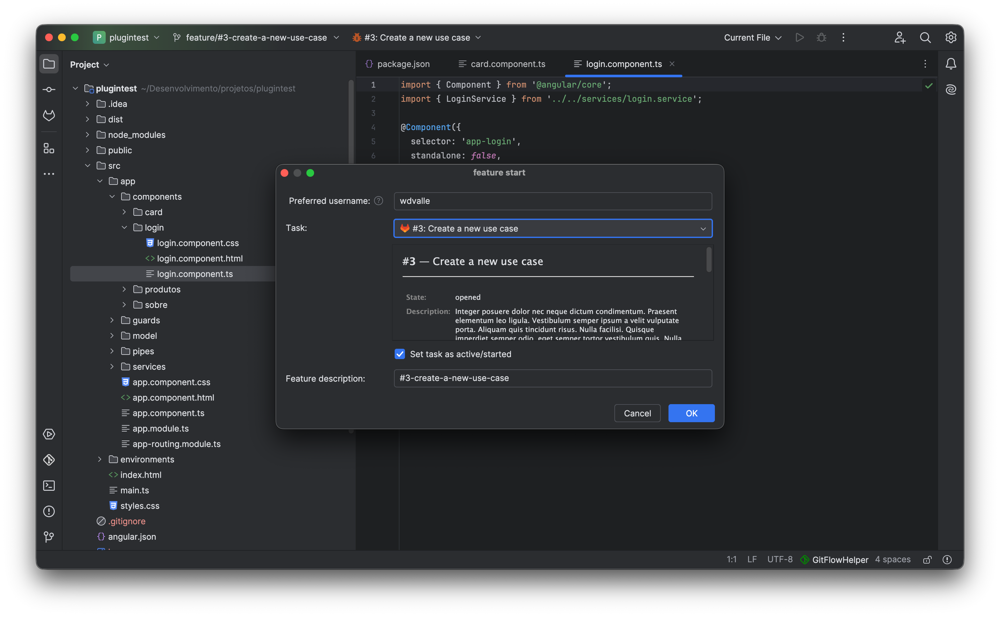

---

### 🚀 CI/CD Pipeline Monitoring (Jenkins)
Stay in your flow without switching back and forth to your browser:
- Per-repository CI/CD server configuration.
- Connects directly to **Jenkins** pipelines.
- Automatically initiates build monitoring when pushing finished code.
- Streams live console chunks progressively with smart ANSI color parsing.
- Secure token storage backed by IntelliJ's `PasswordSafe`.

---

### 🗂️ Branch Navigation & Interactive Tree View
- **Status Bar Integration**: Access all operations, view current branch status, and trigger actions directly from the IDE status bar.
- **Interactive Tree Explorer (`Show as tree...`)**:
  - Hierarchical visualization grouping branches into `feature`, `release`, `hotfix`, and base folders.
  - **Speed Search**: Start typing to immediately filter and highlight branches.
  - One-click checkout and branch deletion (local and remote).
  - Bookmark indicators for current active branch and production branches.

  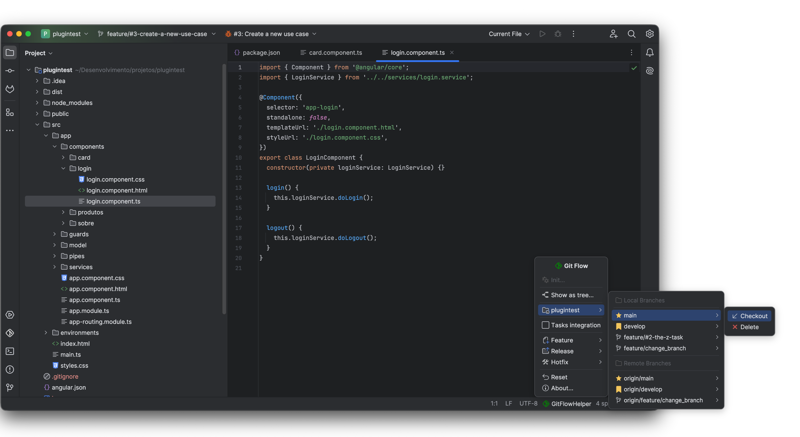
  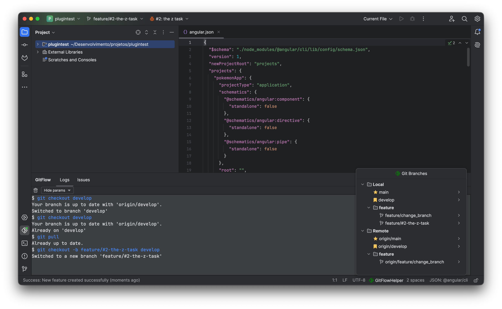

---

## ⌨️ Keyboard Shortcuts

All primary Git Flow operations have default keyboard shortcuts configured:

| Action | macOS Shortcut | Windows / Linux Shortcut | Target Base |
|:---|:---:|:---:|:---|
| **Feature Start** | `⌃ ⌥ 1` | `Ctrl + Alt + 1` | `develop` |
| **Feature Publish** | `⌃ ⌥ 2` | `Ctrl + Alt + 2` | remote origin |
| **Feature Finish** | `⌃ ⌥ 3` | `Ctrl + Alt + 3` | `develop` |
| **Release Start** | `⌃ ⌥ 4` | `Ctrl + Alt + 4` | `develop` |
| **Release Publish** | `⌃ ⌥ 5` | `Ctrl + Alt + 5` | remote origin |
| **Release Finish** | `⌃ ⌥ 6` | `Ctrl + Alt + 6` | `main` + `develop` |
| **Hotfix Start** | `⌃ ⌥ 7` | `Ctrl + Alt + 7` | `main` |
| **Hotfix Publish** | `⌃ ⌥ 8` | `Ctrl + Alt + 8` | remote origin |
| **Hotfix Finish** | `⌃ ⌥ 9` | `Ctrl + Alt + 9` | `main` + `develop` |

> [!TIP]
> You can customize any keybinding anytime under:  
> **Settings (Preferences) → Keymap → Plugins → GitFlow Helper**

---

## 📋 Requirements & Compatibility

- **IDE Version**: IntelliJ IDEA 2024.2+ (Community or Ultimate), Android Studio, or compatible JetBrains IDEs.
- **Java**: Runtime Java 21+.
- **Git Plugin**: Standard bundled `Git4Idea` plugin enabled.
- **Task Management** *(Optional)*: Bundled `com.intellij.tasks` plugin enabled for issue tracker features.

---

## 🛠️ Installation

* **Currently Supported:**
  * **GitHub**
  * **GitLab**
  * **Redmine**
* **Coming Soon:**
  * **Jira**

Alternatively, download the plugin release directly from the [JetBrains Marketplace](https://plugins.jetbrains.com/plugin/30207-git-flow-helper).

---

## 🤝 Contributing & Support

- **Bug Reports & Feature Requests**: [GitHub Issues](https://github.com/wdvalle/gitflow-helper/issues)
- **Source Code**: [wdvalle/gitflow-helper](https://github.com/wdvalle/gitflow-helper)
- **Support the Project**: If GitFlow Helper saves you time and simplifies your daily workflow, consider [buying a coffee on Ko-fi](https://ko-fi.com/waltervalle)!

---

## 📄 License

Distributed under the Apache 2.0 License. See `LICENSE` for more information.
